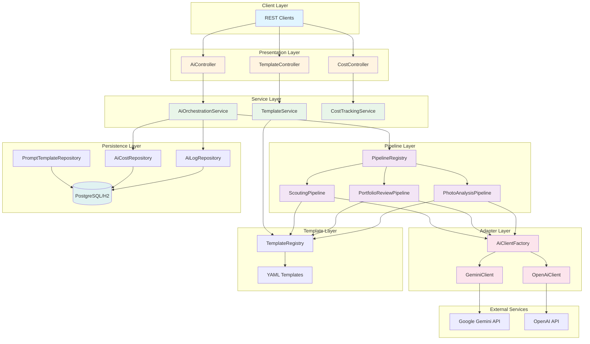
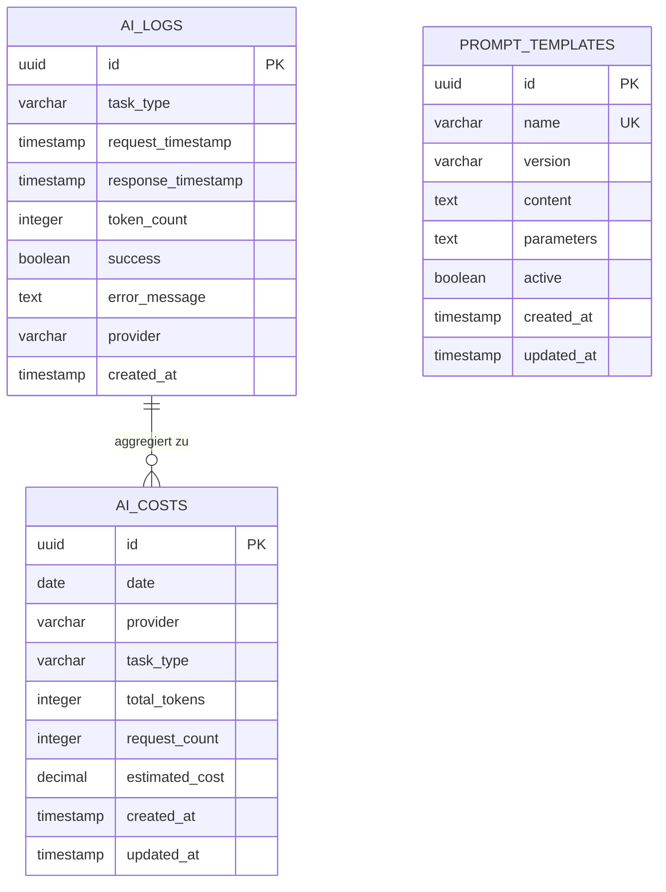
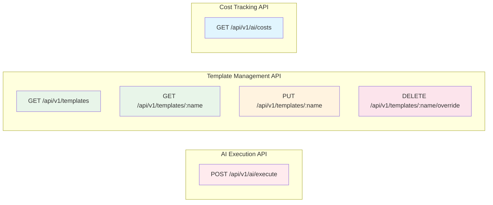
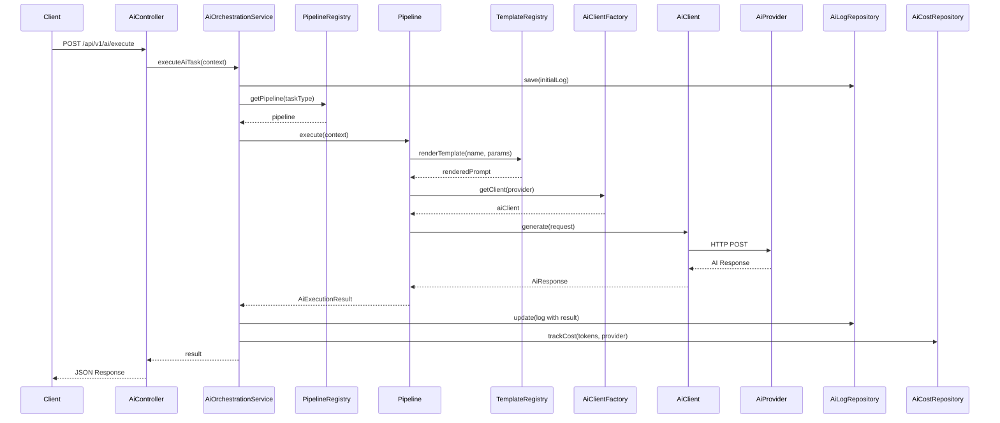
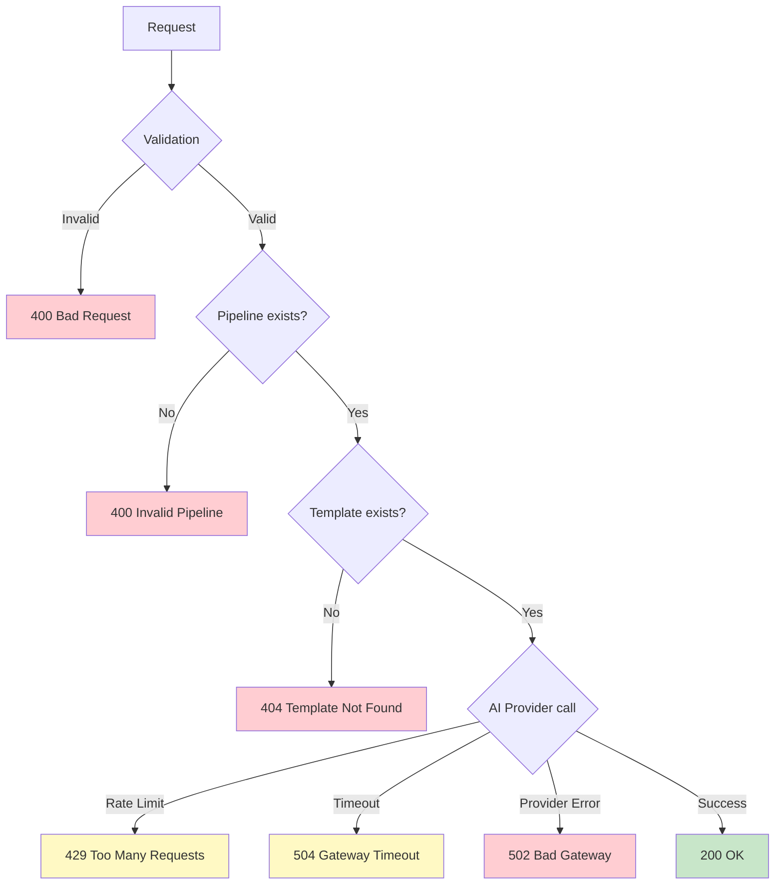
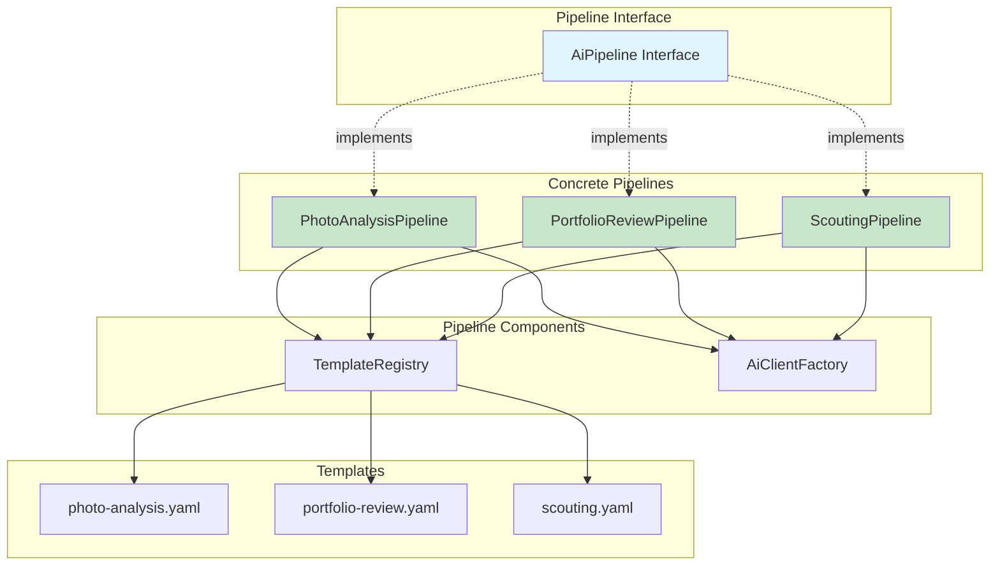

# AI Core Service - Technische Dokumentation

## Übersicht

Der **AI Core Service** ist ein zentraler Microservice zur Orchestrierung von KI-Anfragen. Er bietet eine einheitliche Schnittstelle zu verschiedenen KI-Anbietern (Google Gemini, OpenAI GPT) und ermöglicht die Verwaltung von Prompt-Templates, Kostentracking und strukturiertes Logging.

**Technologie-Stack:**
- Kotlin 2.0.0
- Spring Boot 3.2.0
- PostgreSQL / H2
- Flyway (Datenbank-Migrationen)
- OpenAPI/Swagger

---

## Architektur

### Schichtenarchitektur



### Komponenten-Beschreibung

#### 1. **Presentation Layer (Controller)**
- **AiController**: Hauptendpoint für KI-Pipeline-Ausführung
- **TemplateController**: Verwaltung von Prompt-Templates
- **CostController**: Abfrage von Kosten und Token-Verbrauch

#### 2. **Service Layer**
- **AiOrchestrationService**: Koordiniert Pipeline-Ausführung, Logging und Kostentracking
- **TemplateService**: Template-Verwaltung und -Abruf
- **CostTrackingService**: Aggregation und Reporting von Kosten

#### 3. **Pipeline Layer**
- **PipelineRegistry**: Mapping von TaskType zu Pipeline-Implementierungen
- **PhotoAnalysisPipeline**: Analyse von Fotos (Qualität, Komposition)
- **PortfolioReviewPipeline**: Bewertung von Foto-Portfolios
- **ScoutingPipeline**: Analyse von Locations für Fotografie

#### 4. **Adapter Layer**
- **AiClientFactory**: Auswahl des KI-Providers
- **GeminiClient**: Integration mit Google Gemini API
- **OpenAiClient**: Integration mit OpenAI GPT-4 API

#### 5. **Template Layer**
- **TemplateRegistry**: Lädt YAML-Templates beim Start
- **YAML Templates**: Prompt-Vorlagen mit Parametern

#### 6. **Persistence Layer**
- **Repositories**: Spring Data JPA Repositories
- **Entities**: JPA-Entitäten (AiLog, AiCost, PromptTemplate)

---

## Datenmodell

### Entity-Relationship-Diagramm



### Tabellen-Details

#### **ai_logs**
Speichert alle KI-Anfragen und -Antworten für Audit und Monitoring.

| Spalte | Typ | Beschreibung |
|--------|-----|--------------|
| id | UUID | Primärschlüssel |
| task_type | VARCHAR(50) | Art der Aufgabe (PHOTO_ANALYSIS, etc.) |
| request_timestamp | TIMESTAMP | Zeitpunkt der Anfrage |
| response_timestamp | TIMESTAMP | Zeitpunkt der Antwort |
| token_count | INTEGER | Anzahl verwendeter Tokens |
| success | BOOLEAN | Erfolg der Anfrage |
| error_message | TEXT | Fehlermeldung bei Misserfolg |
| provider | VARCHAR(50) | Verwendeter KI-Provider |
| created_at | TIMESTAMP | Erstellungszeitpunkt |

**Indizes:**
- `idx_ai_logs_task_type` auf `task_type`
- `idx_ai_logs_timestamp` auf `request_timestamp`
- `idx_ai_logs_success` auf `success`

#### **ai_costs**
Aggregiert Kosten und Token-Verbrauch pro Tag, Provider und Task-Type.

| Spalte | Typ | Beschreibung |
|--------|-----|--------------|
| id | UUID | Primärschlüssel |
| date | DATE | Datum der Aggregation |
| provider | VARCHAR(50) | KI-Provider |
| task_type | VARCHAR(50) | Art der Aufgabe |
| total_tokens | INTEGER | Gesamtanzahl Tokens |
| request_count | INTEGER | Anzahl Anfragen |
| estimated_cost | DECIMAL(10,4) | Geschätzte Kosten in USD |
| created_at | TIMESTAMP | Erstellungszeitpunkt |
| updated_at | TIMESTAMP | Aktualisierungszeitpunkt |

**Unique Constraint:** `(date, provider, task_type)`

**Indizes:**
- `idx_ai_costs_date` auf `date`
- `idx_ai_costs_provider` auf `provider`

#### **prompt_templates**
Optional: Datenbank-Speicherung von Templates (primär werden YAML-Dateien verwendet).

| Spalte | Typ | Beschreibung |
|--------|-----|--------------|
| id | UUID | Primärschlüssel |
| name | VARCHAR(100) | Template-Name (unique) |
| version | VARCHAR(20) | Template-Version |
| content | TEXT | Template-Inhalt |
| parameters | TEXT | Erforderliche Parameter (JSON) |
| active | BOOLEAN | Template aktiv |
| created_at | TIMESTAMP | Erstellungszeitpunkt |
| updated_at | TIMESTAMP | Aktualisierungszeitpunkt |

---

## REST API Endpoints

### API-Übersicht



### Endpoint-Details

#### 1. **AI Pipeline Ausführung**

**`POST /api/v1/ai/execute`**

Führt eine KI-Pipeline mit den angegebenen Parametern aus.

**Request Body:**
```json
{
  "taskType": "PHOTO_ANALYSIS",
  "promptParams": {
    "photographerName": "Alice",
    "genre": "Cityscape"
  },
  "binaryInput": "BASE64_ENCODED_IMAGE",
  "provider": "gemini"
}
```

**Request Parameter:**
- `taskType` (required): `PHOTO_ANALYSIS` | `PORTFOLIO_REVIEW` | `SCOUTING`
- `promptParams` (required): Map mit Template-Parametern
- `binaryInput` (optional): Base64-kodiertes Bild
- `provider` (optional): `gemini` | `openai` (Standard: gemini)

**Response:**
```json
{
  "success": true,
  "content": "{\"overallScore\": 85, \"technicalQuality\": {...}}",
  "tokenCount": 1234,
  "provider": "gemini",
  "errorMessage": null
}
```

**Status Codes:**
- `200 OK`: Erfolgreiche Ausführung
- `400 Bad Request`: Ungültige Parameter
- `429 Too Many Requests`: Rate Limit überschritten
- `502 Bad Gateway`: KI-Provider-Fehler
- `504 Gateway Timeout`: Timeout bei KI-Anfrage

---

#### 2. **Template-Verwaltung**

**`GET /api/v1/templates`**

Listet alle verfügbaren Template-Namen auf.

**Response:**
```json
[
  "photo-analysis",
  "portfolio-review",
  "scouting"
]
```

---

**`GET /api/v1/templates/{name}`**

Ruft ein spezifisches Template ab.

**Path Parameter:**
- `name`: Template-Name (z.B. "photo-analysis")

**Response:**
```json
{
  "name": "photo-analysis",
  "version": "1.0",
  "description": "Analyzes uploaded photos for quality...",
  "parameters": ["photographerName", "genre"],
  "content": "You are an expert photography critic...",
  "hasOverride": false
}
```

**Status Codes:**
- `200 OK`: Template gefunden
- `404 Not Found`: Template existiert nicht

---

**`PUT /api/v1/templates/{name}`**

Überschreibt ein Template zur Laufzeit (nicht persistent).

**Path Parameter:**
- `name`: Template-Name

**Request Body:**
```json
{
  "content": "Your custom prompt template here..."
}
```

**Response:**
```json
{
  "message": "Template override set for: photo-analysis"
}
```

**Status Codes:**
- `200 OK`: Override gesetzt
- `404 Not Found`: Template existiert nicht

---

**`DELETE /api/v1/templates/{name}/override`**

Entfernt ein Template-Override.

**Path Parameter:**
- `name`: Template-Name

**Response:**
```json
{
  "message": "Template override cleared for: photo-analysis"
}
```

---

#### 3. **Kosten-Tracking**

**`GET /api/v1/ai/costs`**

Ruft eine Kosten-Zusammenfassung für einen Zeitraum ab.

**Query Parameter:**
- `period` (optional): `day` | `week` | `month` | `year` (Standard: month)

**Response:**
```json
{
  "period": "month",
  "startDate": "2024-10-24",
  "endDate": "2024-11-24",
  "totalTokens": 125000,
  "totalCost": 3.75,
  "requestCount": 42,
  "breakdown": [
    {
      "provider": "gemini",
      "taskType": "PHOTO_ANALYSIS",
      "tokens": 50000,
      "cost": 0.25,
      "requests": 20
    },
    {
      "provider": "openai",
      "taskType": "PORTFOLIO_REVIEW",
      "tokens": 75000,
      "cost": 3.50,
      "requests": 22
    }
  ]
}
```

---

## Request-Flow

### Ablauf einer KI-Anfrage



### Fehlerbehandlung



---

## Pipeline-System

### Pipeline-Architektur



### Task Types

| TaskType | Pipeline | Template | Beschreibung |
|----------|----------|----------|--------------|
| `PHOTO_ANALYSIS` | PhotoAnalysisPipeline | photo-analysis.yaml | Analysiert einzelne Fotos auf Qualität, Komposition und künstlerischen Wert |
| `PORTFOLIO_REVIEW` | PortfolioReviewPipeline | portfolio-review.yaml | Bewertet Foto-Portfolios auf Kohärenz und Marktfähigkeit |
| `SCOUTING` | ScoutingPipeline | scouting.yaml | Analysiert Locations für Fotografie-Potenzial |

---

## Konfiguration

### Umgebungsvariablen

| Variable | Beschreibung | Erforderlich | Standard |
|----------|--------------|--------------|----------|
| `GEMINI_API_KEY` | Google Gemini API-Schlüssel | Nein* | - |
| `OPENAI_API_KEY` | OpenAI API-Schlüssel | Nein* | - |
| `DATABASE_URL` | PostgreSQL JDBC URL (Prod) | Ja (Prod) | `jdbc:postgresql://localhost:5432/aicore` |
| `DATABASE_USERNAME` | Datenbank-Benutzername (Prod) | Ja (Prod) | `aicore` |
| `DATABASE_PASSWORD` | Datenbank-Passwort (Prod) | Ja (Prod) | - |

*Mindestens ein API-Key muss konfiguriert sein.

### Profile

#### Development (`dev`)
```yaml
spring:
  datasource:
    url: jdbc:h2:mem:aicore
    driver-class-name: org.h2.Driver
  h2:
    console:
      enabled: true
      path: /h2-console
```

#### Production (`prod`)
```yaml
spring:
  datasource:
    url: ${DATABASE_URL}
    driver-class-name: org.postgresql.Driver
    username: ${DATABASE_USERNAME}
    password: ${DATABASE_PASSWORD}
```

---

## Sicherheit

### API-Key-Verwaltung
- API-Keys werden über Umgebungsvariablen geladen
- Keys werden **niemals** geloggt
- Sichere Speicherung in Secret Manager empfohlen

### CORS
- Konfigurierbar in `CorsConfig.kt`
- Standard: Alle Origins erlaubt (nur für Entwicklung!)
- Produktion: Spezifische Origins konfigurieren

### Authentifizierung
- Aktuell: Keine Authentifizierung implementiert
- Architektur unterstützt einfache Erweiterung mit JWT/JWS
- Empfehlung: API Gateway mit OAuth2/OIDC vorschalten

---

## Monitoring & Logging

### Logging-Strategie

**Development:**
- Console-Ausgabe mit lesbarem Format
- SQL-Queries werden geloggt
- Debug-Level für Application-Code

**Production:**
- JSON-strukturiertes Logging (Logstash-Format)
- Geeignet für ELK-Stack, Splunk, etc.
- Warn-Level für allgemeine Logs, Info für Application-Code

### Metriken

Über `ai_logs` und `ai_costs` Tabellen:
- Anzahl erfolgreicher/fehlgeschlagener Anfragen
- Token-Verbrauch pro Provider
- Durchschnittliche Response-Zeit
- Kosten pro Tag/Monat

---

## Erweiterbarkeit

### Neue Pipeline hinzufügen

1. **Template erstellen** (`resources/prompts/new-task.yaml`)
2. **TaskType erweitern** (`PipelineModels.kt`)
3. **Pipeline implementieren** (`NewTaskPipeline.kt`)
4. **In Registry registrieren** (`PipelineRegistry.kt`)

### Neuen AI-Provider hinzufügen

1. **Client implementieren** (`NewProviderClient.kt implements AiModelClient`)
2. **Konfiguration hinzufügen** (`application.yml`)
3. **In Factory registrieren** (`AiClientFactory.kt`)

---

## OpenAPI/Swagger

Die vollständige API-Dokumentation ist verfügbar unter:
- **Swagger UI**: http://localhost:8080/swagger-ui.html
- **OpenAPI JSON**: http://localhost:8080/api-docs

---

## Deployment

### Lokale Entwicklung
```bash
./gradlew bootRun --args='--spring.profiles.active=dev'
```

### Production Build
```bash
./gradlew build
java -jar build/libs/ai-core-service-0.0.1-SNAPSHOT.jar \
  --spring.profiles.active=prod
```

### Docker (Optional)
```dockerfile
FROM eclipse-temurin:17-jre-alpine
WORKDIR /app
COPY build/libs/ai-core-service-0.0.1-SNAPSHOT.jar app.jar
EXPOSE 8080
ENTRYPOINT ["java", "-jar", "app.jar"]
```

---

## Kontakt & Support

Für Fragen und Support wenden Sie sich an das AI Core Service Team.

**Version:** 1.0  
**Letzte Aktualisierung:** 2024-11-24
